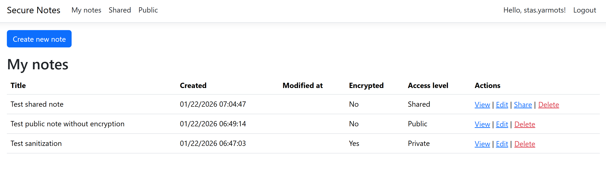
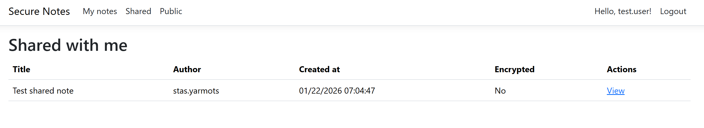
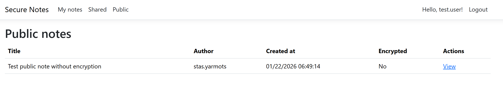
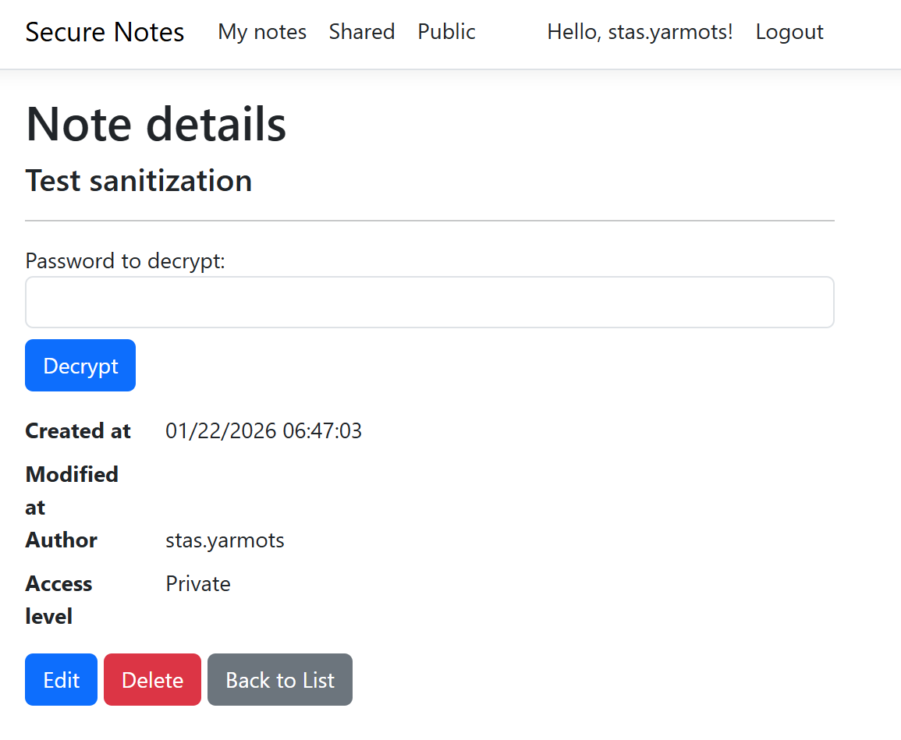
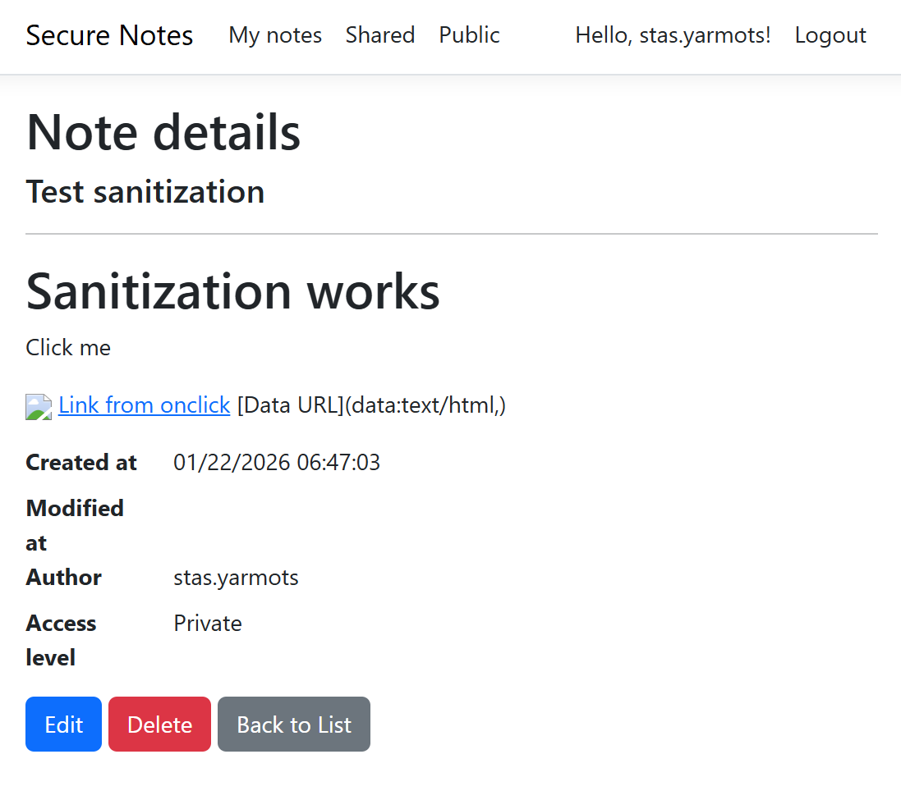
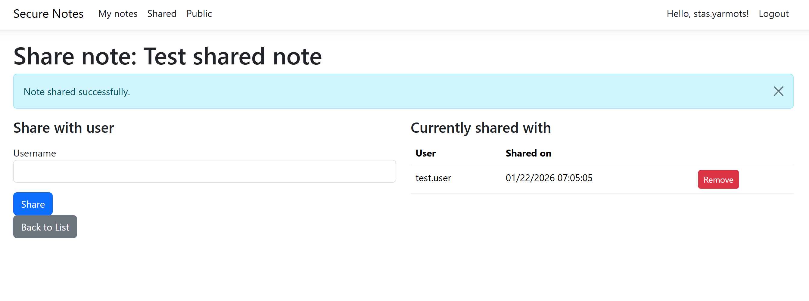
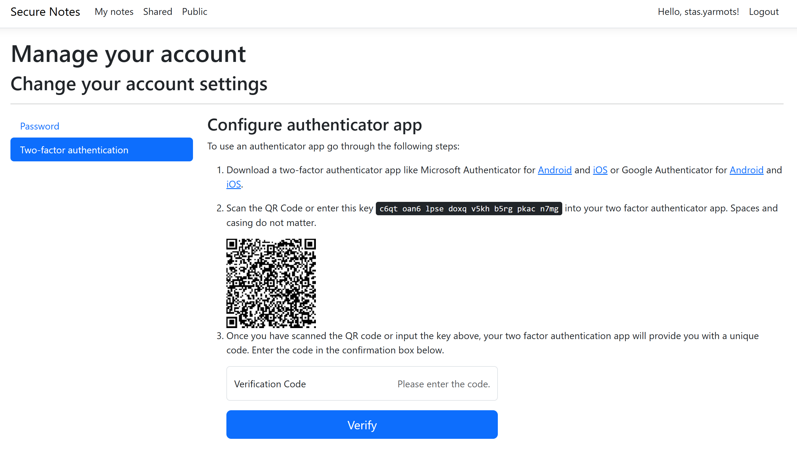
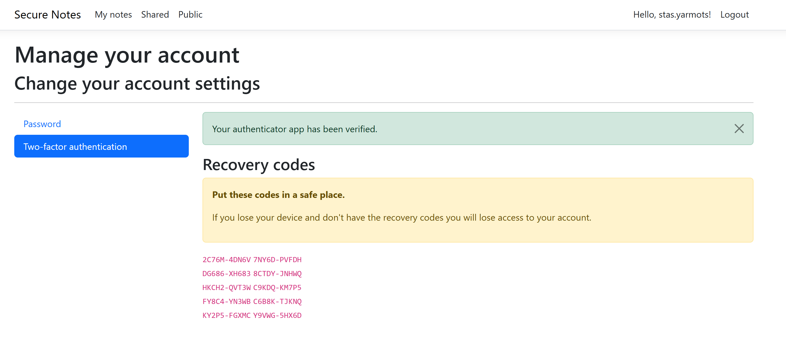
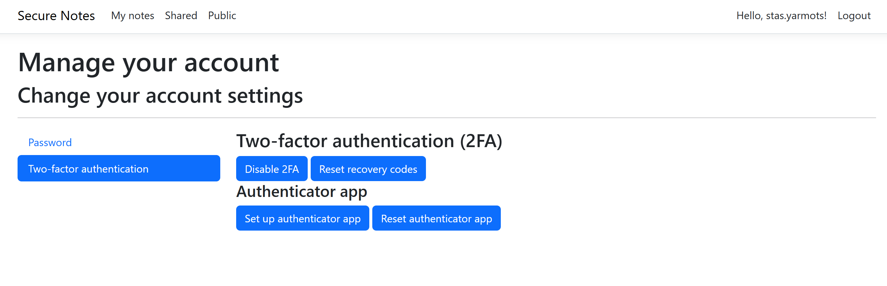
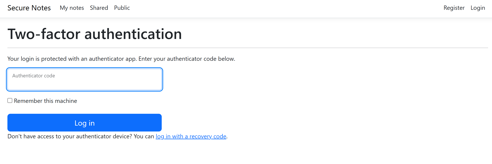

# SecureNotes

A secure note-taking web application built with ASP.NET Core and Razor Pages. SecureNotes provides end-to-end encryption for sensitive notes with password protection, digital signatures for integrity verification, and flexible sharing capabilities.

## Features

### Security Features
- **End-to-end encryption**: Optional AES-256-CBC encryption for sensitive notes with password-based key derivation (PBKDF2 with 100,000 iterations)
- **Digital signatures**: ECDSA (P-256 curve) digital signatures to verify note integrity and authenticity
- **Two-Factor Authentication (2FA)**: TOTP-based authenticator app support for enhanced account security
- **Strong password requirements**: Enforces 12+ character passwords with complexity requirements and entropy validation
- **HTTPS enforcement**: TLS/SSL encryption for all communications with HSTS
- **Account lockout protection**: Automatic 15-minute lockout after 5 failed login attempts
- **Data protection**: ASP.NET Core Data Protection with certificate-based key protection
- **XSS protection**: HTML sanitization for markdown-rendered content (allows only safe tags: p, br, strong, em, h1-h5, a, img)
- **Content Security Policy (CSP)**: Strict CSP headers to prevent injection attacks
- **Rate limiting**: 100 requests per minute per user/IP to prevent abuse
- **Security headers**: Server header suppression, HSTS, CSP enforcement
- **Secure cookie settings**: Security stamp validation every 5 minutes

### Note Management
- **Multiple Access Levels**: 
  - Private (owner only)
  - Shared (selected users)
  - Public (anyone can view)
- **Markdown Support**: Rich text formatting with SimpleMDE markdown editor
- **Live Preview**: Real-time markdown preview while editing
- **Note Sharing**: Share notes with specific users
- **Note Organization**: View your notes, shared notes, and public notes separately
- **Note Versioning**: Track creation and modification timestamps

### Technical Features
- **Dockerized Deployment**: Complete Docker Compose setup with nginx reverse proxy
- **Database Migrations**: Entity Framework Core with SQL Server 2022 with automatic retry on failure
- **Structured Logging**: Serilog integration with console output and custom formatting
- **Rate Limiting**: Fixed window rate limiting (100 req/min per user)
- **Reverse Proxy Support**: Configured for nginx with forwarded headers
- **Health Monitoring**: Automatic database migration on startup

## Technology Stack

- **Framework**: ASP.NET Core 9.0 (Razor Pages)
- **Authentication**: ASP.NET Core Identity with 2FA support
- **Database**: SQL Server 2022 Express
- **ORM**: Entity Framework Core
- **Containerization**: Docker and Docker Compose
- **Reverse Proxy**: Nginx
- **Logging**: Serilog
- **Security Libraries**: 
  - AES-256-CBC encryption (System.Security.Cryptography)
  - ECDSA P-256 signatures (System.Security.Cryptography)
  - Ganss.Xss for HTML sanitization

## Prerequisites

You need to have Docker Desktop installed.

To run this program type `docker compose up`

Certificates are generated using script [certificates](certificates) in root directory. There are generated certificates in folder **certs**. They are valid until 22.01.2027.

## Screenshots

Here are some screenshots of this application:

Views from another user

Sanitization test

Access level is set to private, note is encrypted with password.

View of encrypted note

After typing the password we can see that unsafe tags are removed

Sharing note with other users

2FA configuration

After configuring 2FA app

2FA settings

2FA asked when user try to log in
